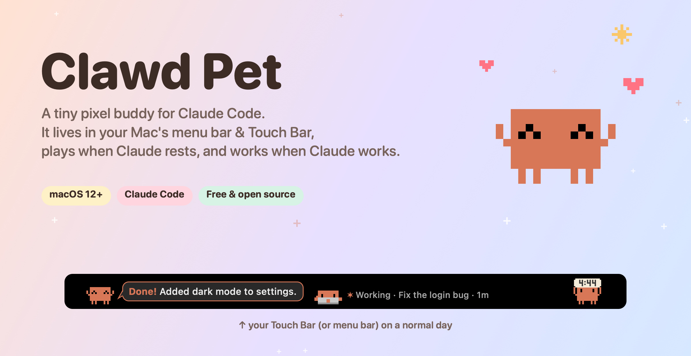
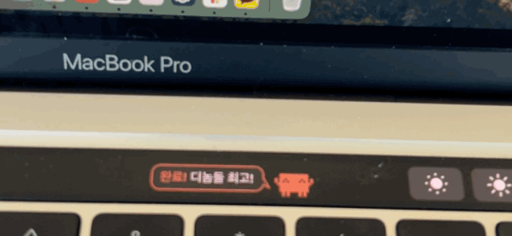
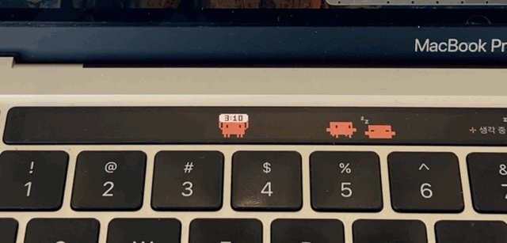
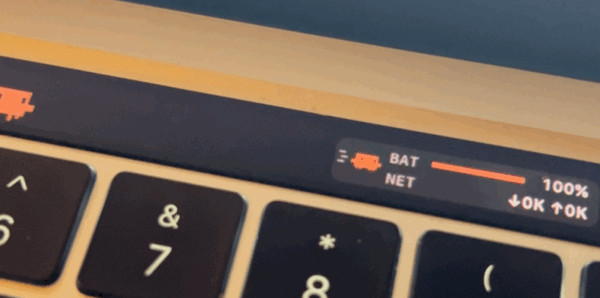
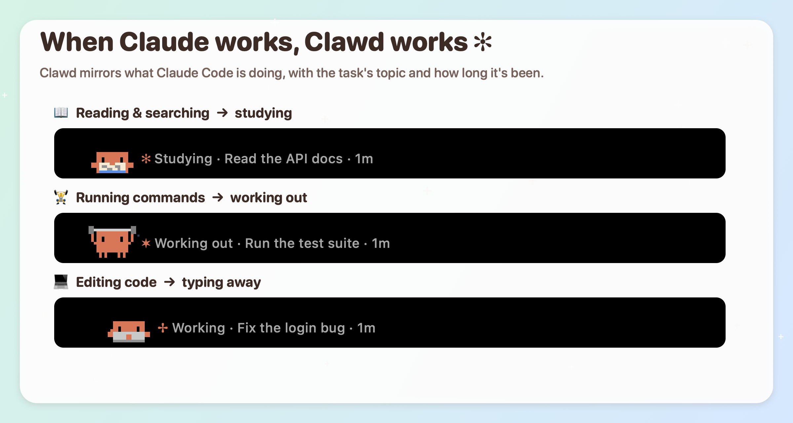
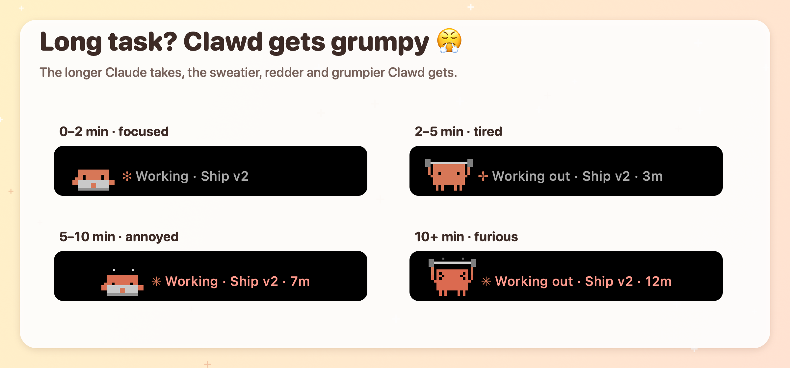
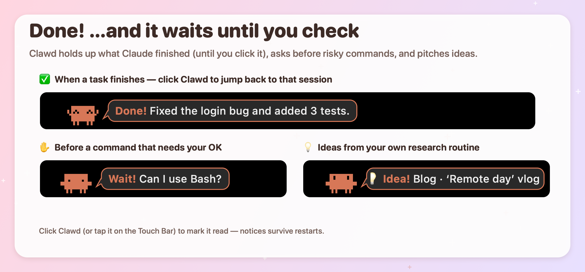
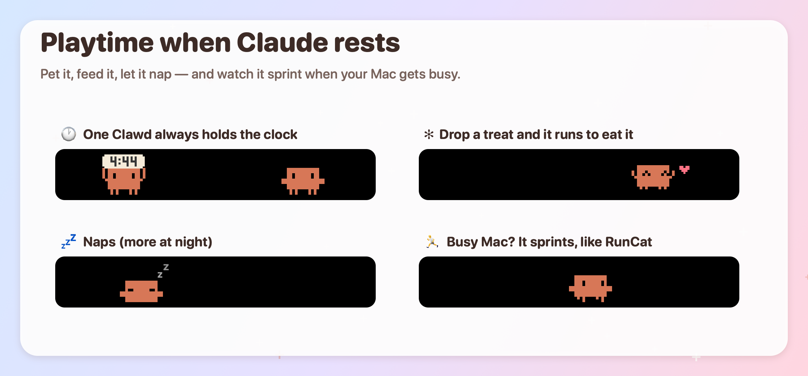
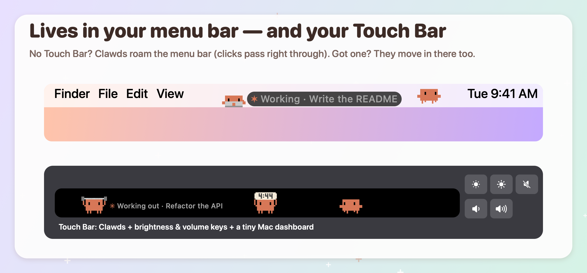

# Clawd Pet

**English** · [한국어](README.ko.md)



Clawd Pet lets **Clawd**, Claude Code's little pixel mascot, loose on your Mac.
When Claude rests, Clawd plays. When Claude works, Clawd works too.

```
 ▐▛███▜▌
▝▜█████▛▘
  ▘▘ ▝▝
```

## ✨ See it on a real MacBook Pro

<table>
  <tr>
    <td width="33%"></td>
    <td width="33%"></td>
    <td width="33%"></td>
  </tr>
  <tr>
    <td align="center"><b>Tap “Done!”</b><br>Clawd says thanks with a ♥</td>
    <td align="center"><b>Clock duty</b><br>one holds the time, the rest nap</td>
    <td align="center"><b>CPU at 100%?</b><br>Clawd sprints, RunCat-style</td>
  </tr>
</table>

<sub>Filmed on a Korean Mac, so the bubbles are in Korean. On an English Mac, Clawd speaks English.</sub>

> **Unofficial fan project.** Made for fun, not affiliated with Anthropic. Claude and Clawd are Anthropic's trademarks and character. Non-commercial.

---

## What it does

- **Works along with Claude Code.** When Claude reads files, Clawd reads a book. Running commands means lifting a dumbbell, and editing files means typing on a tiny laptop. When Claude needs permission, Clawd waves "Wait!". When Claude finishes, Clawd holds up a "Done!" bubble until you check it. Long tasks make it sweaty, then red and grumpy.
- **Runs with your Mac's load.** Pick CPU, GPU or memory. The busier your Mac, the faster Clawd runs, and it sweats above 80%. The menu bar icon runs in place to the same beat, just like RunCat.
- **Lives in three places.** It can float on your screen in a transparent window (the default on Macs without a Touch Bar), roam your menu bar, or move into the Touch Bar if you have one.
- **Loves to play.** Click it and it's happy. Drag it around, press and hold to pet it, or shake it hard to make it dizzy. Drop a treat and it runs for it, and other Clawds race to steal it. It waves when your cursor comes by, says hi to other Clawds, and yawns off to sleep after 11 pm.
- **Grows on you.** Pet it, feed it, check its notices and spend time together to raise your bond: Shy → Acquaintance → Friend → Best friend → Family → Soulmate. Each Clawd keeps a little life record (name, time together, treats, pats), and you can rename it.
- **Extras.** While playing, one Clawd holds a clock sign and goes "Ding!" on the hour. Optionally, a Claude scheduled task can research ideas for you, and Clawd pitches them one at a time in a 💡 bubble.

Running several Claude Code sessions? Add more Clawds. Each one takes a session.

---

## Install (1 minute)

**You need** macOS 12 or later and Claude Code (the Code tab in the Claude desktop app, or `claude` in a terminal).

1. Download `ClawdPet.zip` from [**Releases**](https://github.com/suinegyzal/clawd-pet/releases/latest) and unzip it.
2. Move `ClawdPet.app` to your **Applications** folder and open it.
   - The first time, macOS says **"ClawdPet" Not Opened … Apple could not verify it is free of malware**. The app is shared without a paid Apple developer signature, so this shows once. Here's how to get past it:
     1. Click **Done** in that dialog.
     2. Open **System Settings → Privacy & Security** and scroll down. Next to "ClawdPet was blocked", click **Open Anyway** and enter your password.
     3. Open the app again. It won't ask after that.

     Prefer the terminal? Run `xattr -d com.apple.quarantine /Applications/ClawdPet.app`. On macOS 14 and earlier, you can also right-click the app and choose **Open**.
3. When asked **"Connect Clawd to Claude Code?"**, click **Connect**. The app adds its hooks to your Claude Code settings for you. No terminal needed.
4. **Start a new Claude Code session**, and Clawd starts following along.

**What "Connect" does:** it adds hooks and a status line to `~/.claude/settings.json`. Your other settings stay untouched, and the original file is backed up as `settings.json.bak-clawd`. You can undo it anytime from the Clawd menu in the menu bar with **Disconnect Claude Code**. To start Clawd automatically, turn on **Open at login** in the same menu.

### Build from source

```bash
git clone https://github.com/suinegyzal/clawd-pet.git ~/Documents/ClawdPet && cd ~/Documents/ClawdPet && ./install.sh
```

If Xcode Command Line Tools aren't installed, an installer pops up. Click **Install**, then run `./install.sh` again.
`install.sh` builds the app into `~/Applications/ClawdPet.app`, connects the hooks and launches it.

---

## How it behaves

### When Claude works, Clawd works



| Claude is… | Clawd… |
|---|---|
| idle | walks, runs, hops, sits, naps (more naps the longer Claude rests) |
| thinking about your request | looks up: `✻ Thinking · (topic)` |
| reading, searching, browsing | 📖 reads a book: `Studying · (topic)` |
| running commands | 🏋️ lifts a dumbbell: `Working out · (topic)` |
| editing or writing files | 💻 types on a laptop: `Working · (topic)` |
| asking for permission | waves: `Wait! Can I use Bash?` |
| done | hops with `Done! (first sentence of Claude's answer)`. Click it to bring that session's app (Terminal, Claude desktop…) to the front |

- The **topic** is the session title shown in the Claude app's sidebar. If there is none yet, Clawd shows the start of your request.
- **Done notices stay until you check them**, even after a restart. Click Clawd or its bubble (or tap it on the Touch Bar), send that session a new request, or choose **Mark all done notices read**.

### Long task? Clawd gets grumpy



| Time since your request | Clawd |
|---|---|
| up to 2 min | focused |
| 2–5 min | tired eyes, a little sweat, "Phew…" |
| 5–10 min | squints `> <`, steams, turns a bit red, "Still going?" |
| 10+ min | furious: 💢, bright red, trembling, stomping, "When will it end?!" |

### Done, wait, and ideas



### Playtime



### Menu bar, Touch Bar, or floating



- **Menu bar:** the same number of Clawds doing the same things. Clicks pass right through to your menus; only Clawd itself is clickable. Hidden in full-screen apps.
- **Touch Bar** (MacBook Pro with Touch Bar only): with the Expanded Control Strip setting, Clawd takes the whole bar and adds **brightness −/+ · mute · volume −/+** keys plus a tiny Mac dashboard (CPU·memory / GPU·storage / battery·network).
- **Floating** (default without a Touch Bar): Clawds live in transparent windows on your screen. Clicks on empty space go to the window underneath. **Right-click a Clawd** for its menu: give a treat, pet, add another, send it home. It looks at your cursor and waves, gets dizzy when shaken, and if a done notice sits unread for 45 seconds, it walks over to your cursor to get your attention.

  ```bash
  open ~/Applications/ClawdPet.app --args --desktop
  ```

### The menu bar menu

Click the running Clawd icon in the menu bar to:
- see Claude's status and your Mac's stats (CPU, GPU, memory, storage, battery, network)
- mark done notices read, browse 💡 ideas, drop a treat, add or send home a Clawd
- choose what makes Clawd run (CPU, memory or GPU), toggle the menu bar Clawds and Touch Bar options, connect or disconnect Claude Code, open at login, quit

---

## 💡 Idea routine (optional)

Every few hours, Claude can research trends and write ideas for *your* project, and Clawd pitches them one at a time.
Fill in the `[brackets]` in [`routines/idea-research.md`](routines/idea-research.md), then tell Claude in the desktop app:
"Create a scheduled task that runs this every 3 hours."
Reports go to a folder you choose, and ideas land in `~/.clawd-touchbar/ideas.json`. Click an idea bubble to open its report.

---

## Update · Uninstall

```bash
cd ~/Documents/ClawdPet && git pull && ./install.sh   # update (source install)
cd ~/Documents/ClawdPet && ./uninstall.sh              # remove app + Claude Code hooks
```

`uninstall.sh` quits the app, removes only Clawd's hooks from your Claude Code settings and deletes the app. If you installed from Releases, choose **Disconnect Claude Code** in the menu, then delete the app.

## Troubleshooting

| Problem | Fix |
|---|---|
| Clawd doesn't follow Claude | Start a **new** Claude Code session. Sessions that were already open use the old settings. |
| No Clawd in the menu bar | Check that **Roam the menu bar** is on, and that your menu bar isn't set to auto-hide. |
| Nothing on the Touch Bar | Choose **Show on Touch Bar** in the menu. You may have closed it with the ✕ on the left of the Touch Bar. |
| The Done notice won't go away | That's on purpose. Click Clawd or the bubble, or use **Mark all done notices read**. |
| No Claude usage (5h · 7d) | That info only comes from the terminal Claude Code status line, so the desktop app alone won't show it. |

---

## For developers

```bash
./build.sh && open build/ClawdPet.app                                  # build and run
build/ClawdPet.app/Contents/MacOS/ClawdPet --preview                   # preview in a normal window
build/ClawdPet.app/Contents/MacOS/ClawdPet --snapshot out.png          # render test scenes
CLAWD_LANG=en build/ClawdPet.app/Contents/MacOS/ClawdPet --render-docs docs/en   # regenerate README images
git tag v1.0.1 && git push origin v1.0.1                               # GitHub Actions builds a universal release
```

- No Xcode project, just `swiftc` (Command Line Tools) and plain Swift + AppKit in `Sources/`.
- The UI follows your Mac's language (English or Korean). Force one with `CLAWD_LANG=en` or `CLAWD_LANG=ko`.
- Clawd uses private macOS APIs (`DFRFoundation`, `DisplayServices`) to stay in the Touch Bar while other apps are in front, and to set built-in display brightness, like MTMR, Pock and MonitorControl do. That's fine for personal use, but it can't go on the App Store.
- The hooks do nothing when the app isn't running, and never block Claude Code.

---

Made with too many tokens by **Dnoms** 🇰🇷, a little crew of Korean digital nomads. Issues and PRs are welcome.
